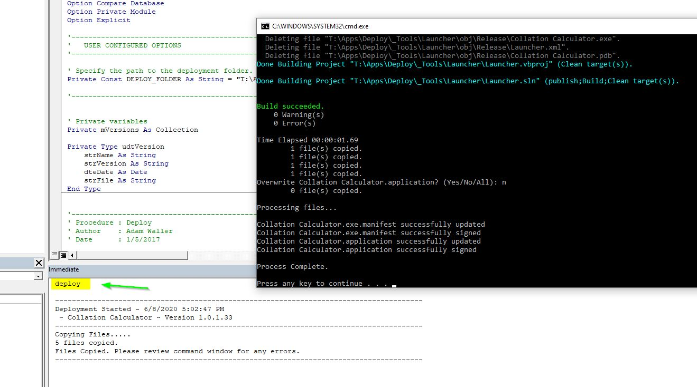

# msaccess-devops
============

# Branch Naming
- Renamed `master` to `stable` as it is a more correct name; development work will be done in other branches, and the `stable` branch will be updated as those changes are proved out.

This project aims to provide an example of how [msaccess-vcs-integration](https://github.com/cenx1/msaccess-vcs-integration) can be used as part of an CI/CD pipeline

## Development Notes

I am providing a copy of files that I use internally for the deployment of Microsoft Access databases to end users via a ClickOnce installer. There is some initial setup and configuration invovled, but once it is up and running, it has worked out very well in our environment with hundreds of updates deployed over several years.

This is not a completely functioning program ready to install.  :-) Instead, it is a rough collection of files and scripts that I have redacted and contributed to this project in the hopes that one day we will have an efficient and automated DevOps process for Microsoft Access database deployment.

The basic concept with the ClickOnce installer is that I have created a very simple .Net application that calls a VBScript file `Application.vbs` which in turn launches the Access database after adding it to the trusted locations.

From the user perspective, the first time they click on the shortcut to {database name}.Application, it installs the program (without requiring Admin rights). On subsequent clicks to the same shortcut, the launcher checks for updates, then launches the database.

On the deployment side, my applications use the `basDeploy.bas` module which allows me to type `deploy` in the immediate window to launch the build process. This copies the database and related files from the GitLab repository into a build folder, then launches MSBuild to build the ClickOnce installer package, signing it with the provided key.

The name and version of the database application are passed in to the build script via command-line arguments, which gives the installer the correct name and version to list in the add/remove programs location.

The single `deploy` command generates the entire installer package, preparing it for installation/update by the end users the next time they launch the program. From a CI perspective, this allows me to make code changes and roll them out to production very rapidly.

Going forward, the idea is that a Windows GitLab runner would do the building and deploying, building the database from source files on GitLab, run verification on the build, then proceed to build the ClickOnce installer package on a share accessed by the end users.

### Key Files
* `Application.vbs` - Stored in the repository for the database application, and used by the launcher to open the database.
* `basDeploy.bas` - A VBA module with source code that creates the build scripts for the installer.
Latest Versions.csv - In my implementation, this stored the latest version of each app so the installer could create the appropriate folder for each release.
* `Deploy.bat` - A batch script that generates and signs the ClickOnce installer package.
* `Template.application` - This is the template that the build script uses to create the installer package. (Name, version, and icon are set via command-line arguments when building.)
* `LauncherApp.vb` - Source code for the launcher .Net application that launches the VBScript.

### Build Environment
To build this project, you will need a few files.
* Microsoft Build Tools (`BuildTools_Full.exe`)
* Certificate (`cert.pfx`) for signing the installer. You can generate this yourself.

### Other Notes
In our environment I used a UNC path for the installer location. In hindsight, I think I would use a URL with an internal DNS name.

### Screen shots

